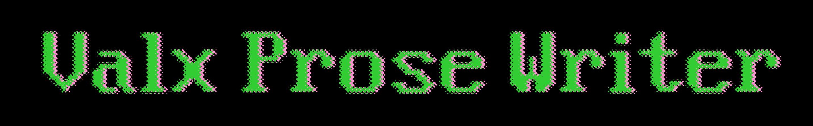
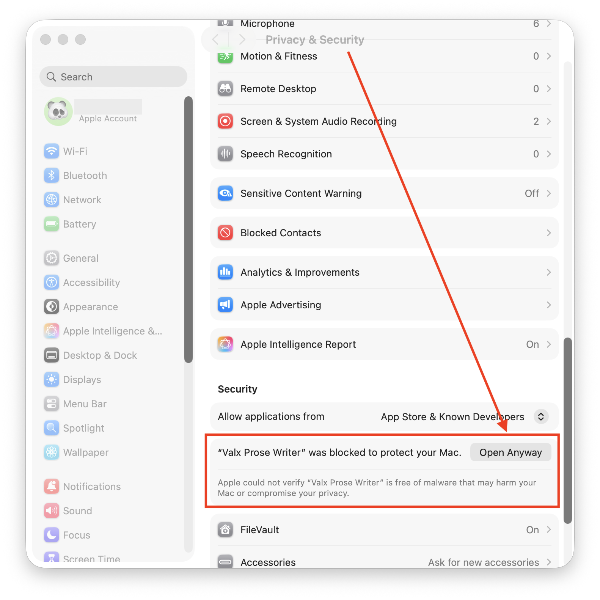

<div align="center">



**A minimalist, local-first writing app. Your words, your disk.**

No accounts. No subscriptions. No telemetry.<br />
Every note is a real file, in a folder you choose, on your machine.

[Download](#download) · [Why Valx](#why-valx) · [Features](#features) · [Typography](#typography) · [Build from source](#build-from-source)



</div>

---

## Download

| Platform | Download |
|---|---|
| **Windows** 10 / 11, 64-bit | [`valx-prose-writer-setup.exe`](https://github.com/natededforver/valx-writer/releases/latest/download/valx-prose-writer-setup.exe) |
| **macOS** 11 Big Sur and up | [`valx-prose-writer.dmg`](https://github.com/natededforver/valx-writer/releases/latest/download/valx-prose-writer.dmg) — universal, Apple Silicon & Intel |
| **Linux** | No published build yet — [build your own package](#linux-build-your-own-package) in about five minutes. |

Every version lives on the [releases page](https://github.com/natededforver/valx-writer/releases).

Built with [Tauri](https://tauri.app/): a Rust shell over the OS's own webview —
WebView2 on Windows, WKWebView on macOS. The Windows installer is under 7 MB.

> **First launch.** Windows may ask you to confirm an app from a new publisher —
> choose *More info → Run anyway*. On macOS, right-click Valx in Applications and
> choose *Open* once. Both go away once the builds are signed.

## Run instruction:



## Why Valx

Most writing apps that look and function like this want a monthly fee, an account, and
your text in their database. With Valx, you own everything, down to the software's code itself.

| | Valx | The usual subscription writing app |
|---|---|---|
| **Cost** | Free Forever. | Monthly/ Annual subscription forever Or, a one-time price but you'll get charged for major updates as if you haven't given them money already. |
| **Account** | None. There is no server to sign in to. | Required before the first keystroke. |
| **Your files** | Plain `.md` / `.txt` / `.html` in a folder you picked. Readable by anything, for the next millennium and beyond. | A proprietary database or cloud store that you have to pay to access your files. |
| **If it disappears** | Your notes are still sitting on your disk. | You export while you still can. |
| **Export** | PDF, MD, TXT, DOCX and ODT, in the app. | Frequently the reason for a subscription upgrade. |
| **Sync** | Your Drive / Dropbox / Mega / OneDrive folder, or none at all. | Their sync, their servers, their price for access to even 3rd party cloud services that you already pay for. |
| **Platforms** | Windows and macOS, same app. | The cleaner paid apps are often Mac-only. Sometimes, Windows will be 2nd priority with slow updates. |
| **Size** | Under 8 to 20 MB — it borrows your OS's webview. | Hundreds of MB, because Electron ships a browser for your app to run inside it. |
| **Telemetry** | None. The app collects no user information, everything stays local. | Usually, you have to ask and opt-out if they do collect data. |

The one thing here you cannot get elsewhere for free of cost is **slop detector (provenance)** — the ability to
mark in the document itself, which words are **yours** and which words came from other sources like, AI and other websites.

## Features

### Writing

- Markdown renders as you type — `#`, `**bold**`, `*italic*`, `~~strike~~`, lists, tables and code blocks become themselves the moment you finish them.
- Press `/` for a menu that inserts headings, lists, tables, dividers and media without your hands leaving the keyboard.
- Drop into the raw markdown source whenever you want to see the real text.
- Code blocks arrive syntax-highlighted with their own gutter and line numbers.
- Tables are edited in place: tab between cells, add and remove rows and columns.
- Letter spacing and word spacing get their own dialog, with a sample paragraph that re-flows as you drag — set in the writing surface's own typeface, so what you tune is what you get.
- Auto-capitalize handles the start of your sentences and stays out of everything else.
- The caret is lime and sits on the text's own box, so you always know where you are — including on an empty line.



*Elsewhere: a live-markdown surface this complete is usually the paid tier, and the typographic controls usually aren't offered at all.*

### Words

- The app carries its own Hunspell-compatible spellchecker with English, French, German, Italian and Spanish built in.
- That means spelling behaves identically on Windows and macOS, rather than deferring to whatever the OS webview happens to ship.
- **Dictionary** — add a word once and the app stops questioning it.
- **Forbidden Words** — a list of the words you are trying to stop reaching for. Every match goes grey in the editor.
- Forbidden matching is whole-word and case-insensitive, ignores punctuation, and handles multi-word phrases.
- The greying is painted over your text, never into it. It never reaches the `.md` on disk.



*Elsewhere: bundled multilingual spellcheck is rare in a free app, and a personal "stop using this word" list is close to unheard of.*

### Provenance — "Mark as"

- Select any text and mark it as written by you, by AI, or taken from another website.
- A web mark asks for the source and appends the reference line for you.
- Name your co-authors and mark their passages to them; the byline assembles itself.
- Marked words carry colour along a ramp, so a page shows its mixed authorship at a glance.
- Toggle any provenance type out of view to read the document without it.
- Turn **Human authors** off to invert the question — everything *unmarked* greys out, and only what came from elsewhere stays lit.

*Elsewhere: no other writing app does this with 0 cost.*

### Organization

- Folders and tags, with a sidebar that expands in place rather than throwing you into a new screen.
- Search jumps to the matching word inside the note, not just to the note.
- Bookmark what you are working on this week.
- Multi-select for bulk moves.
- Link notes to each other; clicking a link opens the note, not a browser.
- Trash asks before it deletes for good, and holds per-note delete alongside Empty Trash.



*Elsewhere: standard — but here it runs over a plain folder you can also open in Finder, Explorer or `git`.*

### Files and formats

- Every note is a real file. Choose `.md`, `.txt` or `.html` and that is genuinely what lands on disk.
- Convert one note — or an entire workspace — between `.md`, `.txt`, `.html` and `.docx` in a click.
- Export to PDF, DOCX or ODT. Tables and file attachments survive the round trip.
- Drag images, audio and video straight into a note, paste them from the clipboard, or use **Import media** for GIFs and PDFs too. All of it is referenced from disk, never inflated into the note itself.



*Elsewhere: bulk format conversion is usually a separate tool, and export is usually the upgrade prompt.*

### Sync, your way

- Point your workspace at a Google Drive, Dropbox or Mega folder and their own client does the syncing. No Valx account, ever.
- For OneDrive, sign in under Settings and Valx syncs directly — conflicts resolved by newest edit, no OneDrive client required.
- Or point it at an ordinary folder and stay completely offline.

*Elsewhere: sync is the subscription. Here it is a folder path.*

### The window itself

- Distraction-free mode fades the chrome away until you reach for the top edge.
- Dark mode, transparency, word count and line numbers are all one click in View.
- Frameless with app-drawn caption buttons on Windows; native decorations and traffic lights on macOS.



## Typography

Every typeface ships inside the app, so the writing surface looks the same on a
machine that has none of them installed.

| Face | Where | Credit |
|---|---|---|
| **Valuex** | the app's default prose typeface | created by **tchkrv**, made specifically for this app. |
| **Blue Screen** | The greeting in the top left corner of the sidebar, and the branding in external sources related to this app. | © **[Billy Argel](https://www.billyargel.com/)**, 2021 |
| **Segoe UI / SF Pro** | UI chrome, sidebar, menus, dialogs | © **[Microsoft](https://learn.microsoft.com/en-us/typography/font-list/segoe-ui)** and  © **[Apple](https://developer.apple.com/fonts/)** |
| **Lucida Console** | Fallback option if Valuex fails to load in text editor | © **[B&H](https://lucidafonts.com/)** |

**Blue Screen is a personal-use font.** It is used here for a single decorative
greeting. If you fork this app for anything commercial, buy a licence from
[billyargel.com](https://www.billyargel.com/) or swap the `@font-face` rule in
[`src/index.css`](src/index.css) for a face you can use — the greeting is the
only place it appears.

On macOS the UI resolves to Apple's own SF Pro through the system font stack.
Apple's licence forbids redistributing it, so Windows falls back to Segoe UI.

There is no font picker. The editor typeface is a fixed part of the app's
identity — changing it is an edit to the `@font-face` rules, not a setting. Though, users can use **Format >** **Letter Spacing** and **Word Spacing**
sliders to change the finer visual details of the text editor's typeface.

## Platform differences

The app is the same everywhere; the window it lives in is not.

| | Windows | macOS | Android |
|---|---|---|---|
| Window | Frameless, app-drawn caption buttons | Native decorations and traffic lights | Full screen, edge to edge |
| Menus | In-window menu bar | In-window menu bar plus the system menu bar | One `⋯` sheet, iOS-style |
| Shortcuts | `Ctrl` | `⌘`, shown with proper glyphs | None — labels hidden |
| Closing | Closing the window quits | `⌘W` hides, `⌘Q` quits, Dock icon restores | The OS owns it |
| Distraction-free | Chrome fades away | Chrome and traffic lights fade; hover the top edge | Focus mode; tap the top edge |
| Moving between notes | Click the list | Click the list | Swipe, as well |

Everything that differs lives in
[`src-tauri/tauri.macos.conf.json`](src-tauri/tauri.macos.conf.json) and
[`src-tauri/tauri.android.conf.json`](src-tauri/tauri.android.conf.json), which
Tauri merges over the base config only on that host. The base config stays the
Windows one, so a Windows build is unaffected by either overlay.

### Android

The phone build is the same app, reshaped for a thumb rather than ported to a
different one — same notes, same files, same `.md` on disk.

**What is different**

- **Focus mode.** The `⤢` button in the navigation bar drops everything but the
  page and the caret. Tap the top edge of the screen to bring the bar back; it
  retreats again a few seconds later.
- **Three panels, moved between by swiping.** The note list, the editor and the
  menu sit side by side, and each enters from the side it lives on:

  ```
  NOTE LIST  ◀──────  EDITOR  ──────▶  MENU PANEL
             swipe →          swipe ←
  ```

  The menu panel holds everything the desktop's five menus hold, grouped the
  same way — both are rendered from the same code, so neither can quietly lose
  a command the other has. It also has a grip on the right edge, for anyone who
  would rather tap than swipe.
- **Share** is the one permanent button in the navigation bar, and it opens the
  system share sheet rather than the desktop's list of web targets. The phone
  already knows which apps can take a note.
- **Print** goes through Android's print dialog, which is also where "Save as
  PDF" lives.
- **Long-press to drag.** HTML5 drag and drop is a mouse API a touchscreen
  never triggers, so filing notes into folders and dragging them to the bin was
  drawn but unreachable. Press and hold a note to lift it, then drop it on a
  folder or on Trash. Holding the note near the top or bottom of the list
  scrolls it, so a folder below the fold is still a target — the finger holding
  the note is not free to scroll with.
- **Installed as "Valx Writer."** The launcher ellipsises a longer label, and
  the desktop bundle's full name did not survive it.
- **Import media** (in the menu panel) and clipboard paste both take images,
  video, audio, GIFs and PDFs into the workspace's `.attachments` folder.

**What is missing, and why**

- **OneDrive sync.** The OAuth redirect is a loopback listener on `127.0.0.1`,
  which a phone browser hand-off never returns to. The module isn't compiled
  into the Android binary at all.
- **Valx's own spellchecker.** Five bundled dictionaries are 8 MB of text *per
  ABI* inside the APK, to duplicate what the keyboard already does. The phone
  uses the keyboard's checker instead.
- **Provenance marking (the Creators menu).** Every label it defines is applied
  through the right-click "Mark as" menu, and a finger has no right-click.

**Where the notes live**

First launch adopts `Android/data/com.valx.prose_writer/files/Documents/Valx` —
the app's own external storage, which needs no permission. **File > Open
Folder…** moves the workspace anywhere on the device.

That second part needs *All files access*. The app keeps notes as ordinary
`.md` files and scans the folder with `std::fs` from Rust — real paths, not
`content://` URIs — and reading real paths outside its own storage is exactly
what scoped storage withholds on Android 11+. So the first attempt sends the
user to the Settings screen where the grant is made; after that the system
folder picker opens directly. **This rules out a Play Store listing without a
declared exemption**, which is why the app ships as an APK.

Exports land in an `Exports` subfolder of the workspace, and the app says so in
a toast — Android has no save dialog to ask with.

**Building it**

Needs the Android SDK, the NDK, a JDK 17+, and the Rust Android targets:

```bash
rustup target add aarch64-linux-android armv7-linux-androideabi
```

With `ANDROID_HOME`, `NDK_HOME` and `JAVA_HOME` set:

```bash
npx tauri android build --apk --target aarch64 --target armv7
```

Release builds are signed from `src-tauri/gen/android/keystore.properties`,
which points at a keystore beside it. **Neither is in the repository** — both
are gitignored, and a clone builds unsigned until you drop in your own:

```bash
keytool -genkeypair -v -keystore src-tauri/gen/android/valx-release.jks \
  -alias valx -keyalg RSA -keysize 2048 -validity 10000
```

```properties
# src-tauri/gen/android/keystore.properties
storeFile=valx-release.jks
storePassword=…
keyAlias=valx
keyPassword=…
```

`minSdk` is 24 and `targetSdk` 36, so anything from Android 7.0 up will install.

## Build from source

You'll need [Node.js](https://nodejs.org/) 20+ and the
[Rust toolchain](https://www.rust-lang.org/tools/install). On macOS the Command
Line Tools are enough (`xcode-select --install`) — full Xcode is **not** required,
since Tauri assembles the `.app` and `.dmg` itself instead of driving `xcodebuild`.

```bash
npm install
npm run tauri:dev
```

| Command | What it does |
|---|---|
| `npm run dev` | Vite only, in a browser tab — uses the Web File System Access API instead of the desktop bridge. Quick UI iteration. |
| `npm run lint` | TypeScript type check. |
| `node --import tsx --test src/lib/*.test.ts` | Unit tests for the pure logic modules. |
| `npm run tauri:build` | Production build for the host platform, under `src-tauri/target/release/bundle/`. |
| `npm run mac:release` | macOS release: universal `.app` + `.dmg` with stable asset names in `out/release/`. See [`scripts/release.sh`](scripts/release.sh); the Windows counterpart is [`scripts/release.ps1`](scripts/release.ps1). |

### Linux: build your own package

There is no official Linux release, and the app has not been tested on Linux —
but nothing in it is Windows- or macOS-specific, and Tauri builds `.deb`, `.rpm`
and `.AppImage` from the same source.

**1. Install the Tauri system dependencies.**

```bash
# Debian / Ubuntu
sudo apt update && sudo apt install -y libwebkit2gtk-4.1-dev build-essential \
  curl wget file libxdo-dev libssl-dev libayatana-appindicator3-dev librsvg2-dev
```

```bash
# Fedora
sudo dnf install -y webkit2gtk4.1-devel openssl-devel curl wget file \
  libappindicator-gtk3-devel librsvg2-devel libxdo-devel && sudo dnf group install -y "C Development Tools and Libraries"
```

```bash
# Arch
sudo pacman -S --needed webkit2gtk-4.1 base-devel curl wget file openssl \
  appmenu-gtk-module libappindicator-gtk3 librsvg xdotool
```

**2. Install Node.js 20+ and Rust**, then clone and install:

```bash
git clone https://github.com/natededforver/valx-writer.git && cd valx-writer && npm install
```

**3. Build.** The bundle target list in `tauri.conf.json` is `["nsis"]` — the
Windows installer — so you must ask for the Linux bundles explicitly:

```bash
npm run tauri build -- --bundles deb,rpm,appimage
```

Your packages land in `src-tauri/target/release/bundle/`, one directory per
format. Install the one you want:

```bash
sudo dpkg -i src-tauri/target/release/bundle/deb/*.deb        # Debian / Ubuntu
sudo rpm -i  src-tauri/target/release/bundle/rpm/*.rpm        # Fedora
chmod +x     src-tauri/target/release/bundle/appimage/*.AppImage && ./src-tauri/target/release/bundle/appimage/*.AppImage
```

If you only want to try it first, `npm run tauri:dev` runs the app without
packaging anything.

> Two things to expect. The window is frameless with app-drawn caption buttons,
> since that is the non-macOS branch — your desktop environment may prefer to
> draw its own. And WebKitGTK is a third webview engine, so rendering can differ
> in small ways from WebView2 and WKWebView. Both are fixable; please
> [open an issue](https://github.com/natededforver/valx-writer/issues) if you hit
> one.

## Website

The landing and download pages are in https://natededforver.github.io/valx-writer

## License

Polyform Noncommercial 1.0.0 — see [LICENSE](LICENSE). The Blue Screen typeface
is licensed separately for personal use only; see [Typography](#typography).
